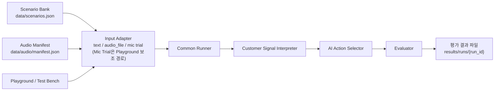

<div align="center">
  <h2>Wind: Whisper Intent Interruption Detection</h2>
  <p><strong>AI가 말하는 중 들어온 고객 신호를 해석하고, 다음 행동을 고르는 실험 콘솔</strong></p>

  <p>
    
    
    
    
  </p>
</div>

Wind는 음성 AI 상담 중 고객이 말을 끊거나 요청을 바꿨을 때, AI가 계속 말할지 멈출지, 답하고 이어갈지, 다른 업무로 전환할지를 판단하는 실험 프로젝트입니다.

이 저장소는 완성된 상담 서비스를 만들기보다, AI가 말하는 중 들어온 고객 발화를 작은 판단 케이스로 나누고 판단 정책(policy)별 행동 선택 결과를 비교하는 Test Bench와 Playground에 집중합니다.

텍스트 입력과 오디오 파일 입력은 같은 판단 흐름을 검증하기 위한 두 가지 입력 경로입니다. 오디오는 Whisper/STT 기반 입력을 검증하기 위한 실험 경로이며, 정량 비교는 Test Bench가 생성한 평가 결과를 기준으로 봅니다.

# 📖 목차

- [문제 배경](#-문제-배경)
- [검증 범위](#-검증-범위)
- [주요 기능](#-주요-기능)
- [대표 실행 결과](#-대표-실행-결과)
- [기술 스택](#-기술-스택)
- [프로젝트 구조](#-프로젝트-구조)
- [빠른 시작](#-빠른-시작)
- [구조](#-구조)
- [Policy 버전](#-policy-버전)
- [평가 방식](#-평가-방식)
- [더 보기](#-더-보기)

<br>

# 🔥 문제 배경

음성 AI 상담에서 고객이 AI 안내 도중 말을 보태거나 요청을 바꾸는 구간은 판단 비용이 큽니다. AI가 계속 말하면 새 요청을 놓칠 수 있고, 모든 발화에 멈추면 상담 흐름이 불필요하게 끊깁니다.

```text
AI: 고객님의 상품은 현재 배송 중이며, 내일 오후 도착 예정입니다.
고객: 아 그게 아니라 환불받고 싶은데요.
```

이 장면에서 중요한 질문은 단순히 "고객이 말했는가?"가 아닙니다.

```text
고객 발화가 맞장구인가?
같은 주제 안의 보충 질문인가?
다른 업무로 바뀐 요청인가?
불만이나 긴급 상황인가?

그렇다면 AI는 계속 말할까, 짧게 인정할까,
답하고 이어갈까, 멈추고 전환할까, 확인 질문을 할까?
```

이 프로젝트는 이런 순간을 작은 판단 케이스(`scenario`)로 잘라 보고, policy가 고른 `actual_action`이 사람이 정한 `expected_actions`와 맞는지 비교합니다.

<br>

# 🔎 검증 범위

현재 MVP의 판단 흐름은 아래와 같습니다.

```text
AI 발화 중
-> 고객 신호 감지
-> 판단 입력 구성(scenario / transcript / audio signal)
-> 고객 신호 해석(predicted_event_type, predicted_user_intent)
-> AI 행동 판단(actual_action)
-> 기대 행동 기준(expected_actions)과 비교
-> 불일치 분석(mismatch analysis)
-> 평가 결과 파일 기록
```

포함하는 범위:

- 커머스 상담 중 AI 발화에 고객 신호가 끼어드는 판단 케이스
- 텍스트 입력과 대표 오디오 파일 입력을 같은 runner로 연결하는 구조
- `baseline`, `policy_v1`, `policy_v2`, `policy_v3`, `policy_v3_1` 비교
- 고객 신호 해석(`predicted_event_type`, `predicted_user_intent`)과 AI 행동 선택(`actual_action`) 기록
- Test Bench 일괄 실행과 평가 결과 파일 생성
- 불일치 케이스를 주요 실패 유형(primary failure)으로 분류

<br>

# 🧩 주요 기능

## 판단 케이스 데이터(scenario)

`data/scenarios.json`에는 AI 발화 중 고객 신호가 들어오는 커머스 판단 케이스가 들어 있습니다. 각 케이스는 기준 입력과 기대 행동만 담고, 실행 결과는 Test Bench가 생성하는 결과 파일에 따로 남깁니다.

핵심 필드:

- `ai_current_intent`: 고객 발화 전 AI의 상담 의도
- `ai_utterance`: AI가 말하던 문장
- `user_utterance`: 고객이 끼어든 발화
- `event_type`: 정답 기준으로 둔 고객 발화 유형
- `expected_actions`: 자연스러운 AI 행동 기준

## Playground

FastAPI 정적 UI에서 판단 케이스를 선택하거나 고객 발화를 직접 입력해 policy 판단을 확인할 수 있습니다.

- 선택한 scenario 재생
- 직접 입력한 텍스트 예측
- 단일 policy 결과 확인
- 여러 policy 비교
- Audio File Test와 Mic Trial 보조 입력 확인

Playground는 policy 판단을 탐색하고 문제 케이스를 확인하기 위한 화면입니다. 문서에 남길 비교 수치는 Test Bench 평가 결과를 기준으로 봅니다. Mic Trial은 실시간 입력과 기대 action 조정을 확인하는 보조 경로이며, Test Bench 비교 수치와 분리해 봅니다.

## Test Bench

판단 케이스 묶음을 일괄 실행하고, policy별 결과 파일을 생성합니다.

생성되는 결과 파일:

- `run_meta.json`: 실행 조건, dataset, policy 정보, command
- `evaluation.json`: `action_accuracy`, primary failure 요약, mismatch matrix, latency
- `decision_logs.jsonl`: 케이스별 reason, signals, expected/actual action
- `error_analysis.md`: 불일치 케이스 요약

## 오디오 파일 입력

대표 오디오 파일을 manifest로 연결해 텍스트 입력과 같은 runner 흐름으로 합류시킵니다.

- `precomputed` transcript로 네트워크 없이 오디오 입력 흐름 확인
- `whisper` transcriber 후보로 실제 STT 연결
- OpenAI TTS 또는 macOS `say`로 fixture 생성
- transcript와 reference transcript 비교값을 signals에 기록

## Dataset Registry

`data/datasets.json`은 기준 core dataset과 진단용 edge slice를 구분합니다.

- `core`: 기본 Text Replay와 Audio File Test가 공유하는 기준 dataset
- `policy_v2_edge`: backchannel, noise, no_speech 안정화 진단
- `policy_v3_edge`: same intent follow-up과 intent shift 경계 진단
- `policy_v3_challenge`: 인접 업무 경계 challenge slice

<br>

# 📊 대표 실행 결과

아래 수치는 Playground 화면이 아니라 Test Bench의 `evaluation.json` 기준입니다.

이 표는 action decision 평가 결과이며, Whisper/STT 자체 성능을 비교한 수치는 아닙니다.

| Dataset               | Policy        | Run ID                        | Correct / Total | `action_accuracy` | Notes                                                                    |
| --------------------- | ------------- | ----------------------------- | --------------: | ----------------: | ------------------------------------------------------------------------ |
| `core`                | `policy_v2`   | `20260515_112306_policy_v2`   |         26 / 30 |            0.8667 | false stop은 안정적이나 일부 intent shift를 놓침                         |
| `core`                | `policy_v3_1` | `20260515_111953_policy_v3_1` |         27 / 30 |            0.9000 | return/refund 경계는 개선됐지만 payment follow-up, complaint 회귀가 남음 |
| `policy_v3_challenge` | `policy_v2`   | `20260515_110153_policy_v2`   |         14 / 18 |            0.7778 | 인접 업무 경계를 같은 흐름으로 묶는 실패가 드러남                        |
| `policy_v3_challenge` | `policy_v3_1` | `20260515_111904_policy_v3_1` |         17 / 18 |            0.9444 | return/refund 인접 업무 `missed_switch`가 0건으로 줄어듦                 |

`policy_v3_1`은 현재 가장 성능이 좋은 prompt-only 후보이지만, 운영에 적용할 정책으로 확정된 것은 아닙니다.

<br>

# ⚙️ 기술 스택

## 백엔드와 Runner

- Python 3.11
- FastAPI + Uvicorn
- Pydantic / Pydantic Settings
- OpenAI Responses API structured output
- Poetry

## 오디오와 신호 처리

- openai-whisper
- webrtcvad
- soundfile
- librosa
- OpenAI TTS API
- macOS `say` fixture generation

## 평가와 데이터

- pytest
- ruff
- numpy / pandas
- scikit-learn
- sentence-transformers

## 문서

- MkDocs 설정(`mkdocs.yml`)
- Markdown 기반 프로젝트 문서

<br>

# 📁 프로젝트 구조

```text
.
├── data/
│   ├── scenarios.json                    # 판단 케이스 기준 원본
│   ├── datasets.json                     # Test Bench dataset registry
│   ├── scenarios_policy_v2_edge.json     # policy_v2 진단용 slice
│   ├── scenarios_policy_v3_edge.json     # policy_v3 경계 진단 slice
│   ├── scenarios_policy_v3_challenge.json
│   └── audio/
│       ├── manifest.json                 # Audio File Test 입력 목록
│       └── README.md
├── src/
│   ├── runner.py                         # 터미널에서 실행하는 runner
│   ├── backend/
│   │   ├── main.py                       # FastAPI API와 정적 UI
│   │   └── static/                       # Playground/Test Bench UI
│   └── interruption_detection/
│       ├── models.py                     # action, event, schema 모델
│       ├── runner.py                     # 공통 policy 실행 흐름
│       ├── llm.py                        # OpenAI structured output client
│       ├── policies/                     # baseline, policy_v1, v2, v3, v3_1
│       ├── interpreter/                  # 고객 신호 해석 계층
│       ├── action_selector/              # AI 행동 선택 계층
│       ├── audio/                        # 오디오 manifest, STT, signal adapter
│       └── evaluation/                   # 평가 로직과 실행 결과 파일
├── tests/                                # runner, policy, API, audio, UI 테스트
├── results/
│   └── runs/{run_id}/                    # Test Bench 실행 결과
├── docs/                                 # MkDocs 문서
├── scripts/
│   └── generate_audio_fixtures.py
├── pyproject.toml
└── README.md
```

<br>

# 🚀 빠른 시작

## 1. 설치

```bash
poetry install
```

Python `>=3.11,<4.0`과 Poetry 2.x 기준입니다. `pyproject.toml`과 `poetry.lock`은 준비되어 있지만, 로컬 환경에 `poetry` 실행 파일이 없으면 Poetry를 먼저 설치해야 합니다.

## 2. 테스트

```bash
poetry run pytest tests/ -q
```

테스트는 fake LLM client를 사용하므로 OpenAI API key 없이 실행할 수 있습니다.

## 3. 실제 LLM 실행 설정

실제 LLM policy 판단이나 OpenAI TTS fixture 생성을 사용할 때만 환경 변수를 설정합니다.

```bash
cp .env.example .env

export OPENAI_API_KEY=...
export OPENAI_ACTION_MODEL=gpt-5.4-mini
```

`.env`와 credential은 커밋하지 않습니다.

## 4. 단일 판단 케이스 실행

```bash
poetry run python src/runner.py \
  --policy policy_v3_1 \
  --dataset data/scenarios.json \
  --scenario-id commerce_shipping_to_refund_001
```

## 5. Test Bench 결과 생성

```bash
poetry run python src/runner.py \
  --policy policy_v3_1 \
  --dataset data/scenarios.json \
  --write-results
```

결과는 `results/runs/{YYYYMMDD_HHMMSS}_{policy_name}/`에 생성됩니다. 같은 `run_id`는 덮어쓰지 않습니다.

## 6. 오디오 파일 입력 실행

```bash
poetry run python src/runner.py \
  --policy policy_v3_1 \
  --dataset data/scenarios.json \
  --audio-manifest data/audio/manifest.json \
  --audio-transcriber precomputed \
  --write-results
```

`precomputed` transcriber는 manifest의 기준 transcript를 사용하므로, local Whisper 모델을 내려받지 않고 오디오 입력 흐름을 확인할 수 있습니다.

## 7. 선택: 로컬 오디오 fixture 생성

기존 `data/audio/manifest.json`을 그대로 보존하려면 local manifest와 output directory를 따로 지정합니다.

```bash
poetry run python scripts/generate_audio_fixtures.py \
  --provider say \
  --scenario-id commerce_shipping_to_refund_001 \
  --output-dir data/audio/fixtures-local \
  --manifest data/audio/manifest.local.json
```

OpenAI TTS를 사용하려면 `OPENAI_API_KEY`가 필요합니다. local Whisper transcriber를 쓰는 경우에는 모델 다운로드와 오디오 런타임 의존성이 추가로 필요할 수 있습니다.

## 8. API와 Playground 실행

```bash
poetry run uvicorn backend.main:app --reload
```

Playground와 Test Bench UI는 `http://127.0.0.1:8000`에서 확인합니다.

<br>

# 🏗️ 구조



## 1. Scenario는 기준 데이터다

`data/scenarios.json`은 사람이 붙인 기준 입력과 `expected_actions`를 담습니다. `actual_action`, metric, decision log는 Test Bench 결과 파일에 남겨 기준 데이터와 분리합니다.

## 2. 입력 경로는 같은 판단 흐름으로 합류한다

텍스트 입력, 오디오 파일 입력, 마이크 입력은 같은 판단 구조를 실행하기 위한 입력 경로입니다. 입력이 달라도 뒤쪽 policy 판단은 공통 runner를 통과해야 합니다.

## 3. Runner는 모든 실행 경로의 공통 진입점이다

CLI, Backend API, Playground, Test Bench가 같은 runner를 호출합니다. policy 판단 로직은 UI나 API에 흩어 두지 않고 공통 runner 안에 둡니다.

## 4. Interpreter와 Action Selector를 나눠 본다

현재 policy들은 고객 발화를 먼저 해석하고, 그 해석을 바탕으로 AI 행동을 고릅니다.

- 고객 신호 해석: `predicted_event_type`, `predicted_user_intent`, `confidence`, `ambiguity`
- AI 행동 선택: `continue`, `brief_ack`, `respond_and_continue`, `stop_and_switch`, `ask_clarifying`, `handoff`

## 5. 평가 결과는 파일로 남긴다

문서에 남길 비교 수치는 Playground 화면 표시값보다 `results/runs/{run_id}/evaluation.json`을 기준으로 봅니다.

<br>

# 🧪 Policy 버전

Policy version은 서로 다른 제품 파이프라인을 뜻하기보다, 같은 판단 흐름에서 어떤 기준과 예시를 더했는지 비교하기 위한 단위입니다.

| Policy      | 코드 식별자   | 초점                                                                                                       |
| ----------- | ------------- | ---------------------------------------------------------------------------------------------------------- |
| Baseline    | `baseline`    | 최소 transcript context로 고객 신호를 해석하고 action 선택                                                 |
| Policy v1   | `policy_v1`   | action label 정의와 few-shot guidance 추가                                                                 |
| Policy v2   | `policy_v2`   | backchannel, noise, no_speech에서 false stop 안정화                                                        |
| Policy v3   | `policy_v3`   | same-intent follow-up과 intent shift 경계 강화                                                             |
| Policy v3.1 | `policy_v3_1` | 반품과 환불처럼 인접한 업무 경계 강화. 현재 MVP의 prompt-only 후보이며 운영 적용 정책으로 확정된 것은 아님 |

현재 action label vocabulary:

```text
continue
brief_ack
respond_and_continue
stop_and_switch
ask_clarifying
handoff
```

<br>

# ✅ 평가 방식

## 기준 행동과 실행 결과

`expected_actions`와 `actual_action`은 같은 action label 집합을 쓰지만 역할이 다릅니다.

| 항목               | 역할                                  | 위치                                        |
| ------------------ | ------------------------------------- | ------------------------------------------- |
| `expected_actions` | 사람이 미리 정한 자연스러운 행동 기준 | `data/scenarios.json`                       |
| `actual_action`    | policy 실행 후 나온 행동 결과         | `results/runs/{run_id}/decision_logs.jsonl` |

action match는 `actual_action in expected_actions`로 계산합니다.

## 주요 실패 유형(primary failure)

불일치 케이스는 먼저 사용자 경험 관점의 primary failure로 봅니다.

| Failure            | 의미                                              |
| ------------------ | ------------------------------------------------- |
| `false_stop`       | 흐름을 이어가도 자연스러운 상황에서 개입으로 판단 |
| `missed_switch`    | 전환이 자연스러운 상황에서 기존 흐름을 유지       |
| `action_confusion` | 다른 valid action으로 판단                        |
| `ambiguous_intent` | 입력 자체의 의도가 불명확                         |
| `STT_uncertainty`  | transcript 노이즈가 판단 불확실성을 높임          |

## 실행 결과 파일

```text
results/runs/{run_id}/
├── run_meta.json
├── evaluation.json
├── decision_logs.jsonl
└── error_analysis.md
```

비교 수치를 문서에 남길 때는 최소한 아래 정보를 함께 남깁니다.

- `run_id`
- dataset 또는 dataset 기준
- policy version
- 평가 기준
- 실행 날짜
- `evaluation.json` 경로

<br>

# 📚 더 보기

- [Wind Docs](https://voice-ai-interruption-detection-project.github.io/whisper-intent-interruption-detection/): 배포된 MkDocs 문서
- [docs/](docs/): 문서 원본
- [data/audio/README.md](data/audio/README.md): Audio File Test fixture 안내
- [src/backend/PACKAGES.md](src/backend/PACKAGES.md): backend dependency와 책임 경계
