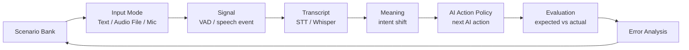

# Interruption Detection MVP 방향성 기준

> 작성일: 2026-05-06
> 상태: 2차 회의 후 기준 방향 v1
> 목적: 1주일 계획표, 개인 방향성, 팀 공유 구상을 종합해 1차 MVP의 고객 문제와 실험 중심축을 정리한다.
> 기준 자료: 1차 회의 정리, 2차 회의 정리, 1주일 계획표, 논문 학습 흐름, 개인 방향성 메모, 팀 공유 구상
> 용어 기준: [용어-결정-노트.md](용어-결정-노트.md)

## 먼저 잡을 고객 장면

이 프로젝트의 출발점은 기술 이름이 아니라 아래 장면이다.

```txt
AI: 고객님의 상품은 현재 배송 중이며, 내일 오후 도착 예정입니다...
고객: 아 그게 아니라 환불받고 싶은데요.

나쁜 경험:
AI가 고객의 새 요청을 못 듣고 배송 안내를 계속한다.

좋은 경험:
AI가 하던 말을 멈추고, 환불 요청으로 상담 흐름을 바꾼다.
```

고객 입장에서 중요한 것은 `interruption detector`나 `action label`이라는 이름이 아니다. 중요한 것은 **AI가 내 말을 알아듣고, 지금 해야 할 행동을 바꾸는가**다.

이 문서의 기술 용어는 모두 이 장면을 설명하고 검증하기 위한 도구다.

## 한 줄 정의

이 MVP는 완성형 상담 AI 앱을 바로 만드는 프로젝트가 아니다. 음성 AI 상담 중 고객이 끼어들거나 요청을 바꿀 때, AI가 `계속 말할지`, `잠깐 멈출지`, `새 상담 흐름으로 바꿀지` 확인하는 **AI 엔지니어용 실험 콘솔**이다.

초점은 "상담 앱처럼 보이는 화면"이 아니라, **VAD-only보다 나은 interruption 판단 구조를 단계별로 검증하는 것**이다.

이 문서에서 **AI Action Policy**는 모델명이 아니라 **어느 상담 상황에서 AI가 어떤 행동을 해야 하는지 정리한 판단 기준**이다.

핵심은 아래 질문에 답하는 것이다.

```txt
사용자가 말했는가?
사용자가 무엇을 말했는가?
기존 상담 의도와 달라졌는가?
AI는 지금 어떤 행동을 해야 하는가?
```

## 2차 회의 후 기준 판단

개인 방향성에서 가장 중요한 판단은 아래처럼 정리할 수 있다.

| 판단 | 이유 | 1주차 반영 |
| --- | --- | --- |
| 상담 AI 앱을 바로 만들지 않는다 | 핵심 문제는 답변 생성보다 개입 판단이다. | 제품 화면보다 실험 콘솔을 우선한다. |
| Text Replay로 먼저 AI Action Policy를 검증한다 | 가장 빠르게 고객 상황과 AI의 다음 행동을 확인할 수 있다. | scenario bank와 expected_action을 먼저 만든다. |
| Text Replay만으로 끝내지 않는다 | 음성 AI 프로젝트인데 텍스트만 있으면 실제 음성 검증이 약하다. | 최소 대표 케이스는 Audio File Test까지 연결한다. |
| Live Mic는 후순위로 둔다 | 실시간 마이크, STT, TTS, 상태 관리에 범위가 커질 수 있다. | input layer를 분리해 나중에 mic stream으로 바꿀 수 있게 둔다. |
| 최종 확장은 커머스 음성 상담이다 | 실험 구조가 실제 제품 기능으로 이어져야 한다. | 배송/환불/반품/결제 intent를 중심으로 잡는다. |

따라서 1주차 최소 기준은 `Text Replay + 대표 Audio File Test`다. Mic은 성능 평가 대상이 아니라, 후속 확장을 막지 않는 입력 구조로 다룬다.

2차 회의에서 추가로 정리된 판단은 아래다.

| 판단 | 의미 | 반영 방식 |
| --- | --- | --- |
| 기존 기술 조합이 업계 표준에 가까울 수 있다 | 새 모델을 만드는 것보다 문제 해결 과정과 검증 구조가 차별점이다. | 실패 케이스, decision log, error analysis를 핵심 산출물로 둔다. |
| 논문은 선행 필수가 아니라 구현 질문을 해결하는 근거다 | 목적 없이 논문부터 읽으면 개발과 분리될 수 있다. | 3일차쯤 구현 중 나온 질문을 기준으로 논문/주제 1개를 공식 리뷰한다. |
| 첫 작업은 페어로 시작한다 | 초반에 데이터, AI Action Policy, 콘솔 구조를 함께 맞춰야 한다. | 2026-05-07 09:30~13:30 첫 페어에서 scenario/data/AI Action Policy skeleton을 잡는다. |

## 읽는 방식: 제품 질문과 기술 질문

용어는 많지만 읽는 기준은 단순하다. 고객 장면을 아래 질문으로 쪼개서 확인한다.

| 고객/기획 질문 | 구현에서 확인할 신호 | 산출물에서 볼 것 |
| --- | --- | --- |
| 고객이 그냥 반응한 것인가, 새 요청을 한 것인가? | speech event, user utterance, backchannel rule | 맞장구나 소음 때문에 AI가 괜히 멈추지 않는가 |
| 고객이 같은 상담 주제 안에서 더 묻는가? | current intent, same intent question | AI가 잠깐 멈추고 짧게 답하는가 |
| 고객이 다른 업무로 바꾸려 하는가? | intent shift, predicted user intent | 배송 안내 중 환불/반품/결제 요청을 놓치지 않는가 |
| 고객 불만이 강해 자동 응답만으로 위험한가? | complaint event, tone/risk hint | 상담사 연결 후보 또는 우선 대응으로 보내는가 |
| 같은 상담 상황을 텍스트, 음성 파일로 확인하고 마이크까지 확장할 수 있는가? | input mode, transcript source, audio metadata | 입력 방식이 달라도 같은 AI Action Policy 판단으로 비교되는가 |
| AI가 왜 그런 결정을 했는지 설명할 수 있는가? | decision log, expected vs actual | 실패 이유와 개선 방향을 말할 수 있는가 |

따라서 최종 메시지는 "좋은 interruption detector를 만들었다"가 아니라, **고객 개입 상황을 제품 행동으로 바꾸는 판단 구조를 만들고 비교했다**에 가깝다.

## 방향성 요약

기존 1주일 계획의 핵심은 유지한다.

```txt
VAD-only baseline을 만든다.
Whisper/STT와 intent shift 감지를 붙인다.
기존 방식과 개선안의 성능 차이를 데이터로 보여준다.
```

다만 MVP의 중심을 단순 detector 성능 비교에서 한 단계 넓혀, **고객 개입 상황에서 AI가 어떤 행동을 선택해야 하는지 검증하는 AI Action Policy 구조**로 정리한다.

```txt
기존 계획:
VAD보다 나은 interruption detector를 만든다.

보완 방향:
VAD-only baseline보다 나은 Interrupt-aware AI Action Policy를 검증한다.
```

이 보완은 다른 기능을 추가하는 것이 아니다. 기존 계획의 결과가 더 잘 설명되고, 고객 문제와 바로 연결되도록 구조를 잡는 것이다.

## 왜 상담 AI 앱을 바로 만들지 않는가

상담 AI 앱을 먼저 만들면 화면은 그럴듯해질 수 있다. 하지만 이 프로젝트의 핵심 문제는 `대화 생성`보다 `개입 판단`이다.

처음부터 앱 형태로 가면 아래 위험이 있다.

- 실시간 마이크, TTS, STT, UI 상태 관리에 시간이 많이 들어간다.
- 정작 VAD-only보다 무엇이 나아졌는지 설명하기 어려워진다.
- 잘 되는 한두 장면은 만들 수 있지만, 여러 상황에서 검증했다는 근거가 약해진다.

그래서 1주차에는 앱보다 `실험 콘솔 + AI Action Policy 검증`을 먼저 만든다. 상담 UI는 이후 확장 가능성을 보여주는 얇은 데모로 두고, 중심은 판단 구조와 평가 결과에 둔다.

## 문제 정의

음성 AI 상담에서 사용자가 중간에 말을 시작했는데도 AI가 기존 답변을 계속하면 사용자는 "내 말을 듣지 않는다"고 느낀다. 반대로 사용자가 단순히 "네", "음"처럼 짧게 반응했을 뿐인데 AI가 매번 멈추면 대화가 끊기고 어색해진다.

따라서 interruption은 단순히 `소리가 있었는가`의 문제가 아니다. 실제 제품 판단은 아래 상황들을 구분해야 한다.

| 고객 상황 | 고객에게 나쁜 경험 | AI가 해야 할 행동 | 확인할 신호 |
| --- | --- | --- | --- |
| 배경음이나 짧은 소리 | AI가 불필요하게 멈춤 | 계속 말하기 | VAD는 잡히지만 의미 발화 아님 |
| "네", "음" 같은 반응 | AI가 대화를 중단함 | 짧게 반응하고 계속 | backchannel rule |
| 같은 의도 보충 질문 | AI가 기존 설명만 계속함 | 잠깐 멈추고 짧게 답하기 | current intent와 같은 범위 |
| 다른 의도 전환 | AI가 이전 의도를 계속 설명함 | 기존 발화를 멈추고 전환 | intent shift |
| 불만 또는 긴급 발화 | AI가 평상시 플로우를 유지함 | 우선순위 조정 또는 이관 | complaint/risk signal |
| 애매한 발화 | AI가 확신 없이 전환함 | 확인 질문 | uncertainty |

이 프로젝트의 문제는 `사용자 음성 이벤트 감지`가 아니라, **AI 발화 중 발생한 사용자 신호를 해석해 다음 행동을 결정하는 문제**다.

## 기존 계획에서 유지하는 축

1주일 계획표의 장점은 실행 순서가 명확하다는 점이다. 아래 축은 그대로 유지한다.

| 유지할 축 | 이유 |
| --- | --- |
| VAD baseline | 기존 방식의 한계를 보여주는 기준선이 필요하다. |
| Synthetic dataset | 1주일 안에 목적에 맞는 데이터를 만들 수 있다. |
| Whisper/STT | 사용자 발화를 텍스트로 바꿔 의미 판단의 입력을 만든다. |
| Intent shift | 단순 음성 감지가 아니라 맥락 전환 여부를 판단한다. |
| Evaluation | 포트폴리오와 면접에서 "왜 나아졌는지"를 설명할 수 있다. |
| Report/GitHub 정리 | 결과를 재현 가능한 산출물로 남긴다. |

## 보완하는 축

보완의 핵심은 `detector` 결과를 `AI Action Policy` 판단으로 연결하는 것이다.

| 보완 지점 | 제품 의미 | 기술 구현 의미 |
| --- | --- | --- |
| Text Replay 선행 | 실제 음성 앱 전에 "상황별 결정표"가 자연스러운지 빠르게 본다. | 처음부터 100개 audio를 만들기보다 text scenario로 AI Action Policy를 검증한다. |
| Action label 정의 | "멈춤/안 멈춤"보다 실제 상담 행동을 설명한다. | `interrupt/no_interrupt`만이 아니라 `continue`, `pause`, `switch`, `handoff` 등을 둔다. |
| 상황 난이도 설계 | 고객 상황이 쉬운 것부터 어려운 것까지 빠지지 않게 한다. | 상담 상황 단위로 테스트 케이스를 구성한다. |
| Decision log | AI가 왜 그런 결정을 했는지 사람에게 설명한다. | AI Action Policy가 사용한 signal과 reason을 남긴다. |
| Error analysis loop | 실패 케이스를 다음 제품 판단 기준으로 되돌린다. | 실패 케이스를 scenario bank에 넣고 threshold/rule을 조정한다. |
| 입력 채널 분리 | 같은 상담 상황을 텍스트와 음성 파일로 확인하고, 이후 마이크 입력으로 확장한다. | text replay, audio file, mic record를 input adapter로 분리한다. |
| AI 엔지니어용 콘솔 | "상담 앱처럼 보이는 화면"보다 판단 근거가 보이는 화면을 우선한다. | input mode, scenario, signal, intent, action, metric을 한 화면에 둔다. |

## 제품/실험 루프

이 프로젝트는 RAG 프로젝트가 `문서 -> chunk -> embedding -> retrieval -> answer -> evaluation` 흐름으로 설명되듯, 하나의 제품/실험 루프로 설명할 수 있어야 한다.

MVP는 두 층으로 나눈다.

| 층 | 목적 | 1주차 산출물 |
| --- | --- | --- |
| 판단 실험대(Test Bench) | 상황별 결정표가 왜 그렇게 판단했는지 검증 | scenario bank, detector 비교, evaluation, decision log |
| 상담 경험 데모(Voice Product Demo) | 사용자가 보는 상담 경험을 짧게 보여줌 | 대표 상담 흐름 2~3개, audio sample 기반 데모 |

1차 구현은 `Test Bench` 중심으로 잡는다. 상담 UI는 데모를 위한 얇은 화면으로 두고, 핵심 구현은 `expected_action`과 실제 AI Action Policy 결과를 비교하는 평가 파이프라인에 둔다.



이 루프의 핵심은 한 번 데모하고 끝나는 것이 아니라, 실패 케이스를 다시 scenario bank에 넣고 AI Action Policy를 개선하는 것이다.

```txt
시나리오 설계
-> detector/AI Action Policy 실행
-> expected_action과 비교
-> 실패 유형 분석
-> threshold, rule, scenario 조정
```

## 입력 채널 설계

실험 콘솔은 입력 레이어를 처음부터 분리한다. 1주차에는 Text Replay와 Audio File Test를 중심으로 만들고, Mic Trial은 후순위 확장 슬롯으로 둔다. 세 모드는 서로 다른 제품 화면처럼 보이지만, 뒤쪽 판단 구조는 같은 `AI Action Policy`로 연결한다.

| 입력 모드 | 확인할 상황 | 1주차 구현 기준 | AI Action Policy에 넘기는 값 |
| --- | --- | --- | --- |
| Text Replay | 상담 상황을 가장 빠르게 검증한다. | `scenario` 또는 직접 입력한 문장을 사용한다. | `user_utterance`, `event_type`, `current_intent` |
| Audio File Test | 같은 상황을 음성 파일로 재생해 본다. | 대표 음성 파일을 업로드하고, 전사 텍스트는 mock/precomputed 값으로 둔다. | `audio_file`, `transcript`, `speech_event` |
| Mic Trial | 실제 마이크 입력 확장 가능성을 본다. | 1주차 필수 평가가 아니라 후순위 확장 슬롯으로 둔다. | `recorded_audio`, `transcript`, `input_latency_hint` |

1주차의 핵심은 STT 모델을 완성하는 것이 아니라, **입력 방식이 달라도 같은 상황별 결정표로 판단할 수 있게 만드는 구조**다. 다만 최소 완료 기준은 `Text Replay + 대표 Audio File Test`로 잡고, 마이크는 이후 실시간 음성 상담으로 넘어가기 위한 입력 레이어 설계로 둔다.

## 핵심 가설

### H1. VAD-only는 출발점이지만 제품 판단으로는 부족하다

VAD는 말소리 같은 신호가 있었는지 판단한다. 하지만 그 신호가 단순 반응인지, 맥락 전환인지, 불만인지, 배경음인지는 모른다.

따라서 VAD-only baseline은 반드시 둔다. 목표는 VAD를 단순히 대체하는 것이 아니라, VAD-only가 어떤 실패를 만드는지 보여주는 것이다.

### H2. Interruption은 floor conflict로 봐야 한다

Turn-taking 관점에서 interruption은 단순 사용자 음성 이벤트가 아니라, AI와 사용자가 동시에 대화 차례를 주장하는 상황이다.

MVP에서는 이 개념을 복잡한 확률 모델로 구현하기보다, AI Action Policy의 판단 프레임으로 쓴다.

```txt
AI speaking + user speech + intent shift
=> floor conflict 가능성 높음
=> stop_and_switch 후보
```

### H3. Whisper/STT는 의미 판단의 입력이다

Whisper/STT는 interruption 판단을 끝내주는 모델이 아니라, 사용자가 무엇을 말했는지 확보하는 입력 레이어다.

`Whisper confidence`라는 표현은 구현체마다 조심스럽게 다룬다. 실제 구현에서는 전사 결과, no speech 여부, 전사 품질, 불확실성 신호처럼 확보 가능한 값을 확인한 뒤 사용한다.

### H4. Intent shift가 개선안의 중심 신호다

사용자 발화가 기존 AI intent와 같은지, 다른 업무 intent로 바뀌었는지 판단하는 것이 VAD-only 대비 핵심 개선점이다.

1차 MVP에서는 SBERT 또는 sentence-transformer 기반 similarity를 사용해 현재 intent와 user utterance 또는 후보 intent description을 비교한다.

### H5. Prosody는 1주차 핵심 구현보다 확장 항목이다

Pitch, intensity, speaking rate 같은 prosody feature는 불만/긴급도 판단에 도움이 될 수 있다. 다만 1주일 MVP에서 prosody 기반 감정 인식까지 구현하면 범위가 커진다.

1주차에서는 `tone_hint`나 간단한 위험도 코드 정도로 남기고, 본격 구현은 향후 개선으로 둔다.

## 시나리오 난이도

기술을 논문 순서대로 붙이는 것도 중요하지만, 실제 테스트는 상담 상황 난이도별로 구성한다.

| Level | 고객 상황 | 제품 결정 | 코드/신호 |
| --- | --- | --- | --- |
| 0 | 사용자가 말하지 않음 | 계속 말하기 | `continue` |
| 1 | 배경음/짧은 소리 | 계속 말하기 | `continue`, VAD threshold |
| 2 | "네", "음" 같은 맞장구 | 짧게 반응하고 계속 | `brief_ack`, backchannel rule |
| 3 | 같은 상담 주제 안의 보충 질문 | 잠깐 멈추고 답하기 | `pause`, STT + intent |
| 4 | 다른 상담 주제로 전환 | 멈추고 주제 바꾸기 | `stop_and_switch`, intent shift |
| 5 | 불만/긴급 발화 | 우선 대응 또는 상담사 연결 후보 | `stop_and_switch` 또는 `handoff` |
| 6 | 애매한 발화 | 확인 질문하기 | `ask_clarifying`, uncertainty |
| 7 | 겹침/소음/실시간 입력 | 지연과 오탐 관리 | streaming/chunking |

1주차는 Level 0~5를 중심으로 잡고, Level 6은 대표 케이스만 넣는다. Level 7은 1주차 이후 확장으로 둔다.

## Action Label

최종 평가는 binary interruption만으로 끝내지 않고, 실제 AI 행동 단위로 본다.

여기서 `action label`은 사용자에게 보이는 문구가 아니라, **AI Action Policy가 내놓은 행동 결과에 붙이는 평가용 이름**이다. 먼저 "이 상황에서 AI가 무엇을 해야 자연스러운가"를 정하고, 그 행동에 `continue`, `pause`, `stop_and_switch` 같은 label을 붙인다.

```txt
AI Action Policy(input) -> action label
```

| 고객에게 자연스러운 AI 행동 | action label | 의미 | 예시 |
| --- | --- | --- | --- |
| 계속 말하기 | `continue` | AI가 기존 발화를 계속한다 | 사용자가 말하지 않음, 배경음 |
| 짧게 반응하고 계속 | `brief_ack` | 짧게 반응하고 흐름을 유지한다 | "네", "음" |
| 잠깐 멈추고 답하기 | `pause` | 같은 주제 안의 질문에 짧게 답한다 | "그래서 언제 도착해요?" |
| 멈추고 주제 바꾸기 | `stop_and_switch` | 기존 발화를 중단하고 새 의도로 전환한다 | "환불받고 싶어요" |
| 확인 질문하기 | `ask_clarifying` | 의도가 불명확해 확인 질문을 한다 | "잠깐만요", "아니요" |
| 상담사 연결 후보 | `handoff` | 사람 상담사 또는 검토로 넘긴다 | 강한 불만, 위험 케이스 |

발표나 리포트에서는 필요하면 이 label을 다시 binary로 묶어 비교할 수 있다.

```txt
continue / brief_ack => no_interrupt
pause / stop_and_switch / ask_clarifying / handoff => interruption_or_intervention
```

## 검증 단계

효율만 생각하면 Text Replay만으로도 AI Action Policy는 만들 수 있다. 하지만 이 프로젝트의 본질은 음성 AI이므로 Text Replay만으로 끝내면 실제 검증이 약하다. 반대로 처음부터 Live Mic로 가면 구현 난이도가 커져 1주일 MVP가 흔들릴 수 있다.

그래서 검증 단계는 아래처럼 둔다.

| 단계 | 이름 | 목적 | 1주차 포함 여부 |
| --- | --- | --- | --- |
| 0 | Scenario Design | 어떤 상황을 맞춰야 하는지 정의 | 포함 |
| 1 | Text Replay | AI Action Policy와 action label 빠르게 검증 | 포함 |
| 2 | Audio File Test | 실제 음성 신호에서 VAD/STT/intent 흐름 검증 | 포함 |
| 3 | Simulated Live Chunk | audio file을 chunk로 잘라 실시간처럼 처리 | 가능하면 포함 |
| 4 | Live Mic / Mic Trial | 실제 마이크 입력의 latency, overlap, 소음 확인 | 후순위 |
| 5 | Commerce Voice Service | 간단한 커머스 음성 상담 서비스로 확장 | 1주차 이후 |

이 구조의 장점은 구현 진행 상태가 그대로 제품/실험 로드맵이 된다는 점이다.

## 데이터셋 방향

처음부터 audio-only로 묶기보다, text scenario와 audio sample을 분리한다. 또한 콘솔에서는 text, audio file, mic 입력을 같은 판단 파이프라인으로 흘려보낼 수 있게 input adapter를 분리한다.

### 1단계: Text Replay Dataset

정책 판단을 빠르게 검증하기 위한 최소 데이터셋이다.

```json
{
  "scenario_id": "commerce_refund_001",
  "level": 4,
  "domain": "commerce",
  "ai_current_intent": "배송조회",
  "ai_utterance": "현재 상품은 배송 중이며 내일 오후 도착 예정입니다.",
  "user_utterance": "아 그게 아니라 환불받고 싶은데요.",
  "event_type": "intent_shift",
  "expected_action": "stop_and_switch",
  "expected_user_intent": "환불요청",
  "notes": "AI 발화 중 사용자가 다른 업무 의도를 제시한 케이스"
}
```

### 2단계: Audio File Test

Text Replay로 AI Action Policy가 잡힌 뒤 대표 시나리오를 TTS/audio로 만든다.

### 3단계: Simulated Live Chunk 또는 Mic Trial

마이크 입력은 1주차 핵심 평가 항목이 아니라 확장 확인 항목이다. 시간이 남으면 audio file을 chunk로 잘라 실시간처럼 처리하거나, 브라우저 마이크 녹음/재생 UI만 얇게 확인한다. STT는 붙이지 않고 사용자가 직접 적은 transcript 또는 미리 준비한 transcript를 사용한다.

권장 규모:

| 단계 | 규모 | 목적 |
| --- | --- | --- |
| 1차 text scenario | 30~50개 | AI Action Policy와 action label 검증 |
| 1차 audio sample | 10~20개 | VAD/STT 연결 확인 |
| simulated live 또는 mic trial | 대표 2~3개 | 후속 live 입력 구조 확인 |
| 리포트 확장 | 50~100개 | 시간이 남을 때 정량 결과 보강 |

## 평가 방향

기본 비교는 `VAD-only baseline`과 `개선 AI Action Policy`를 둔다.

| 평가 항목 | 고객 경험에서 보는 의미 | 구현에서 보는 의미 |
| --- | --- | --- |
| Accuracy | 상황별 기대 행동을 얼마나 맞췄는가 | action label 또는 binary 판정 정확도 |
| Precision | 멈추면 안 되는 고객 흐름을 얼마나 덜 끊었는가 | 개입 판단의 오탐 관리 |
| Recall | 전환이 필요한 고객 요청을 얼마나 놓치지 않았는가 | 개입 판단의 미탐 관리 |
| F1 | 불필요한 멈춤과 놓친 전환의 균형 | precision/recall 균형 |
| False Stop Rate | 맞장구/소음인데 괜히 멈춘 비율 | backchannel/noise인데 intervention으로 본 비율 |
| Missed Switch Rate | 고객이 주제를 바꿨는데 계속 말한 비율 | intent shift인데 no-intervention으로 본 비율 |
| Action Confusion Matrix | 어떤 제품 결정을 자주 헷갈리는지 | action label 단위의 혼동 구조 |
| Error Analysis | 다음에 고칠 제품 판단 기준 | 실패 케이스와 rule/threshold 조정 포인트 |

주의할 점:

- `72% -> 90%` 같은 수치는 실험 전에는 목표 예시로만 둔다.
- threshold는 고정 진리가 아니라 현재 데이터셋에 맞춰 조정한다.
- synthetic 데이터의 한계는 리포트에 명시한다.

## 1주차 성공 기준

1주차에 성공했다고 볼 수 있는 기준은 아래다.

- 상황 난이도별 scenario bank가 있다.
- VAD-only baseline이 있다.
- STT/intent shift를 사용하는 개선 AI Action Policy가 있다.
- Text Replay로 expected_action과 actual_action을 비교할 수 있다.
- 대표 케이스는 Audio File Test까지 연결한다.
- 콘솔에서 Text와 Audio File 입력을 구분해 볼 수 있다.
- Mic 또는 Simulated Live는 후속 확장을 막지 않는 input layer 구조가 있다.
- AI Action Policy 버전별 결과 차이를 볼 수 있다.
- 실패 케이스가 정리되어 다음 개선 방향이 보인다.
- 실시간 STT는 없어도 되지만, 이후 확장 가능한 mic input layer 구조가 있다.

## 2차 회의 후 확정/남은 결정

### 확정된 것

1. 1주차 최소 방향은 `Text Replay + 대표 Audio File Test`로 둔다.
2. MVP의 중심은 단순 detector가 아니라 `Interrupt-aware AI Action Policy`와 실험 콘솔이다.
3. Live Mic는 1주차 필수 평가가 아니라 후순위 확장 슬롯으로 둔다.
4. 논문은 첫날 선행 필수로 두지 않고, 3일차쯤 구현 질문을 기준으로 공식 리뷰한다.
5. 첫 작업은 2026-05-07 09:30~13:30 페어로 시작한다.

### 남은 결정

1. text scenario와 audio sample의 1차 목표 개수
2. action label을 모두 쓸지, 1차 구현에서는 일부만 쓸지
3. STT/Whisper를 실제로 바로 붙일지, mock/precomputed transcript로 시작할지
4. SBERT 비교 기준을 intent label로 할지, intent description으로 할지
5. 최종 산출물을 콘솔, 리포트, GitHub, 발표 자료 중 어디까지 확정할지

## 요약

```txt
1주일 계획의 큰 흐름은 유지한다.
VAD-only baseline과 STT + intent shift 개선안을 비교한다.

다만 MVP의 중심은 단순 detector가 아니라
AI가 어떤 행동을 해야 하는지 판단하는 Interrupt-aware AI Action Policy로 잡는다.

Text Replay로 AI Action Policy를 먼저 검증하고,
대표 케이스는 Audio File Test까지 진행한다.

Live Mic는 후순위로 두되,
input layer를 분리해서 나중에 mic stream으로 바꿀 수 있게 만든다.

최종적으로는 AI 엔지니어가 판단 근거와 실패 케이스를 볼 수 있는
실험 콘솔과 평가 리포트로 마무리한다.
```

## 변경 이력

- 2026-05-06: 2차 회의 정리를 반영해 문서 상태를 회의 전 초안에서 회의 후 기준 방향으로 갱신하고, 확정/남은 결정을 분리
- 2026-05-06: 개인 방향성 문서의 핵심 판단인 "실험 콘솔 우선", "Audio File Test 최소 기준", "Mic 후순위 확장"을 초안에 재반영
- 2026-05-06: 실험 콘솔의 입력 채널을 Text Replay, Audio File Test, Mic Trial로 분리해 문서 구조에 반영
- 2026-05-06: 제품 질문과 기술 신호를 함께 읽을 수 있도록 제품-기술 번역축과 action/평가 용어 설명 보강
- 2026-05-06: 1주일 계획표와 개인 보완 방향을 통합해, detector 성능 비교를 Interrupt-aware AI Action Policy 검증 구조로 재정리
- 2026-05-07: 고객 장면을 먼저 읽도록 도입부 보강, action label이 무엇을 뜻하는지 설명 추가
- 2026-05-07: 용어 결정 노트를 반영해 `policy` 계열 표현을 `AI Action Policy` 중심으로 정리
